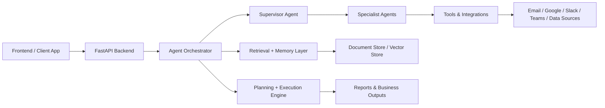
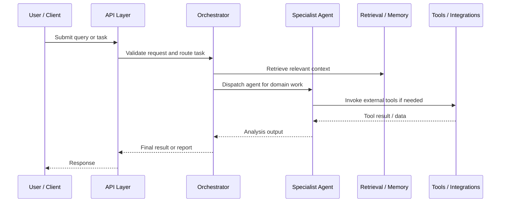
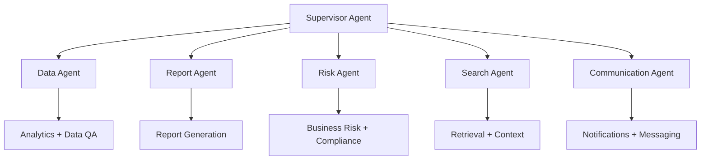
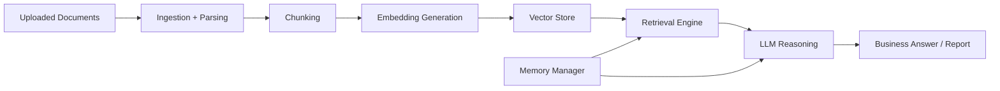

# Office Intelligence Workers Agent

A production-oriented enterprise AI platform for document intelligence, workflow orchestration, business analysis, and multi-agent execution across office operations.

<p align="center">
  
  
  
</p>

## Overview

The Office Intelligence Workers Agent is designed to assist teams with business-critical analysis across documents, reports, financial data, operational records, and workflows. It combines:

- large language model reasoning
- retrieval-augmented generation (RAG)
- multi-agent coordination
- document ingestion and parsing
- structured and unstructured data analysis
- tool-driven business automation

This project is built to support internal operations at the intersection of AI, analytics, and enterprise workflow execution.

## Why this project matters

Modern enterprises generate large volumes of information across spreadsheets, PDFs, emails, contracts, performance reports, and operational logs. This system helps transform that information into actionable insight by:

- retrieving the most relevant context from enterprise data
- routing tasks to specialized analysis agents
- executing workflows through a controllable orchestration layer
- producing structured responses, summaries, and reports

---

## Core capabilities

- Advanced RAG and semantic retrieval
- Provider-agnostic LLM integration
- Multi-agent specialist orchestration
- CSV, Excel, JSON, SQL, and document analysis
- Report generation and execution planning
- File ingestion, storage, and document lifecycle management
- Back-end API for workflow integration
- Extension points for business tools and enterprise integrations

---

## High-level architecture



This architecture gives the system a clean separation between interface, orchestration, intelligence, and execution.

---

## System workflow



---

## Main platform components

| Component | Responsibility |
| --- | --- |
| `app.py` | ASGI/WSGI entry wrapper and runtime bootstrap |
| `backend_api.py` | REST API and service endpoints |
| `agent_orchestrator.py` | Central request routing and orchestration |
| `supervisor_agent.py` | Coordination of multiple specialist agents |
| `specialist_agents.py` | Domain-specific agent façade |
| `reactive_planner.py` | Planning and execution flow management |
| `base_agent.py` | Shared agent base behavior |
| `llm_interface.py` | LLM provider abstraction |
| `embeddings_rag.py` | Retrieval-augmented generation engine |
| `memory_manager.py` | Knowledge and memory persistence |
| `document_manager.py` | File and document lifecycle management |
| `mcp_manager.py` | Tool validation and registry control |
| `tools.py` | Business and integration tool logic |
| `vector_store.py` | Vector memory and retrieval layer |
| `supabase_client.py` | Optional Supabase-backed integrations |
| `report_builder.py` | Report assembly and output generation |

---

## Domain specialist model

The platform is built around a coordination model where a supervisor delegates to specialist agents.



Examples of domain-specific logic in this repository include:

- attendance analysis
- budget and actuals analysis
- cash flow forecasting
- sales pipeline analysis
- payroll and performance review analysis
- vendor spend analysis
- risk and compliance review
- document and data QA tasks

---

## Retrieval and memory architecture

The project includes a layered intelligence stack for grounding answers in enterprise knowledge.



### Retrieval features

- hybrid search for keyword and semantic matching
- rank and relevance refinement
- retrieval context compression
- episodic and semantic memory support
- reusable context for iterative tasks

---

## API surface

The backend exposes a production-oriented API layer for workflow execution and analysis.

| Endpoint | Method | Purpose |
| --- | --- | --- |
| `/health` | GET | Basic health check |
| `/health/live` | GET | Liveness probe |
| `/health/ready` | GET | Readiness verification of runtime dependencies |
| `/query` | POST | Query against retrieved context |
| `/agent/run` | POST | Run a registered specialist agent |
| `/upload` | POST | Ingest files or documents |
| `/upload-file` | POST | Upload a file for later analysis |
| `/download-file` | GET | Download files from storage |
| `/documents` | GET | List available documents |
| `/plan` | POST | Create a work plan |
| `/execute-plan` | POST | Execute a plan |
| `/execute-plan/stream` | GET | Stream execution status |
| `/report` | POST | Generate report payloads |
| `/report/execute-block` | POST | Execute a report block |
| `/report/finalize` | POST | Finalize report output |
| `/tools/credentials` | POST | Update tool credentials |
| `/status` | GET | Runtime status overview |

> Authentication is enforced for most routes; health checks remain publicly accessible.

---

## Quick start

### 1. Bootstrap the environment

```powershell
python start.py
```

This creates or reuses a virtual environment and installs dependencies from `requirements.txt` when required.

### 2. Configure runtime settings

Create a `.env` file based on `.env.example` and configure the values you need.

```env
OFFICE_INTELLIGENCE_SHARED_SECRET=replace-with-a-strong-secret
OFFICE_INTELLIGENCE_ALLOWED_ORIGINS=http://localhost:3000
LLM_PROVIDER=deepseek
MAX_UPLOAD_BYTES=52428800
```

### 3. Start the backend

```powershell
python -m uvicorn office_intelligence.api:app --reload --host 127.0.0.1 --port 8000
```

The API is then available locally at:

```text
http://localhost:8000
```

### 4. Deploy on Render

The project includes a Render configuration in `render.yaml`.

```text
uvicorn office_intelligence.api:app --host 0.0.0.0 --port $PORT
```

---

## Example usage

### Query a dataset

```python
from agent_orchestrator import AgentOrchestrator

agent = AgentOrchestrator(config={"llm_provider": "deepseek"})
agent.ingest_file("loan_data.xlsx")
result = agent.query("Which clients have payment delays?")
print(result.answer)
```

### Plan and execute work

```python
plan = agent.plan("Send payment reminders to overdue clients", top_k=5)
if plan.needs_confirmation:
    confirmed = input("Confirm? ").lower() == "yes"
else:
    confirmed = True

result = agent.execute_plan(plan, confirmed=confirmed)
print(f"Goal achieved: {result.goal_achieved}")
```

### Generate a report

```python
report = agent.generate_report(
    goal="Create Q4 2024 risk assessment",
    query="high-risk clients, default rates",
    top_k=10,
)

if report.ready_to_finalize:
    report.to_word("Q4_Assessment.docx")
```

---

## Supported document and data types

- PDF and scanned documents
- Excel and CSV files
- JSON payloads
- Word documents
- images with OCR support where installed
- structured business datasets for reporting and analysis

---

## Security and production readiness

This is a strong architectural foundation, but it is important to treat it as an actively evolving platform rather than a fully hardened production deployment.

The project documentation explicitly highlights the need to address:

- duplicate route registration in `backend_api.py`
- secure credential storage
- sandboxing of code execution tools
- tenant isolation for uploads, memory, and credentials
- secure handling of service tokens and allowed origins

These topics are essential before public deployment or enterprise-scale production use.

---

## Documentation index

- [README_PRODUCTION.md](README_PRODUCTION.md) — production overview and system architecture
- [README_DETAILED.md](README_DETAILED.md) — source map, implementation notes, and deeper technical reference
- [DETAILED_FUNCTIONALITY_REPORT_UPDATES.md](DETAILED_FUNCTIONALITY_REPORT_UPDATES.md) — functionality and QA updates
- [ENTERPRISE_OPERATING_MODEL.md](ENTERPRISE_OPERATING_MODEL.md) — operating model and enterprise guidance

---

## Project status

- Active implementation in progress
- Multi-agent architecture present and modular
- API and orchestration structure in place
- Production hardening still required for secure large-scale deployment

**Python version:** 3.11.9

---

## Summary

The Office Intelligence Workers Agent is a flexible, extensible AI platform for enterprise operations and intelligent business workflows. It is built around a modular architecture, domain-specialist agents, retrieval-grounded reasoning, and enterprise API integration.

With its combination of document ingestion, analysis, planning, retrieval, and multi-agent orchestration, it provides a strong foundation for AI-powered business automation.
